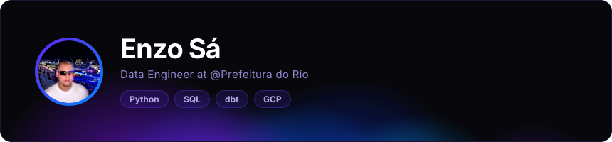
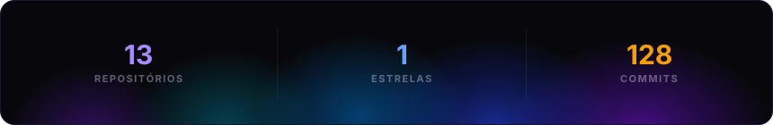
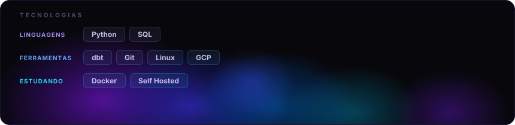

<picture>
  <source media="(max-width: 600px)" srcset="./.github/assets/mobile/readme-aura-component-0-41fae467.svg">
  
</picture>

<picture>
  <source media="(max-width: 600px)" srcset="./.github/assets/mobile/readme-aura-component-1-3249890c.svg">
  
</picture>

<picture>
  <source media="(max-width: 600px)" srcset="./.github/assets/mobile/readme-aura-component-2-fd0e1f17.svg">
  
</picture>

Visual inspirado em <a href="https://github.com/collectioneur/collectioneur">collectioneur</a> · gerado com <a href="https://github.com/collectioneur/readme-aura">readme-aura</a>

