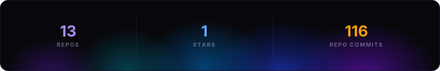
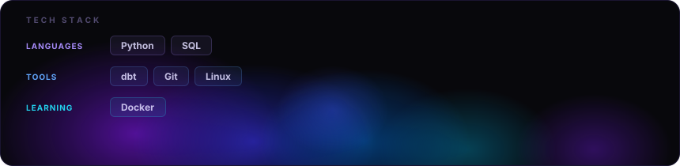

<picture>
  <source media="(max-width: 600px)" srcset="./.github/assets/mobile/readme-aura-component-0-637968f7.svg">
  
</picture>

<picture>
  <source media="(max-width: 600px)" srcset="./.github/assets/mobile/readme-aura-component-1-78401c31.svg">
  
</picture>

<picture>
  <source media="(max-width: 600px)" srcset="./.github/assets/mobile/readme-aura-component-2-b19eab8e.svg">
  
</picture>

Layout inspired by <a href="https://github.com/collectioneur/collectioneur">collectioneur</a> · powered by <a href="https://github.com/collectioneur/readme-aura">readme-aura</a>

